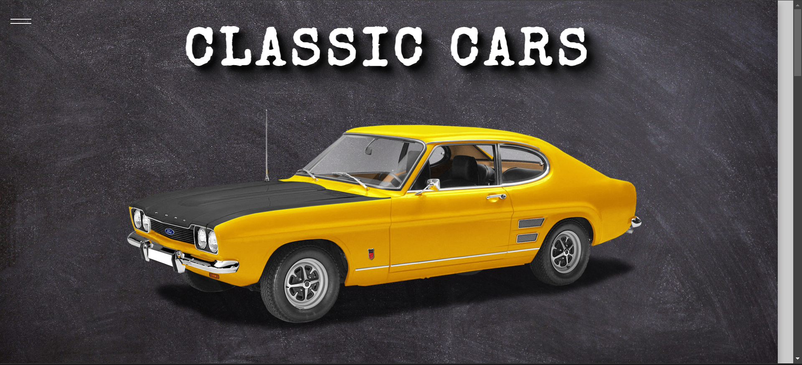
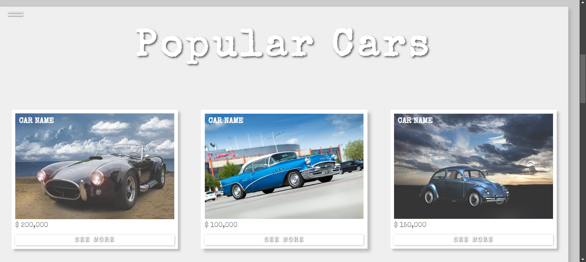
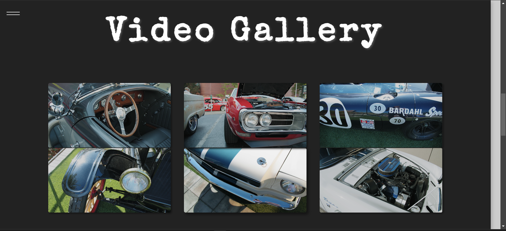
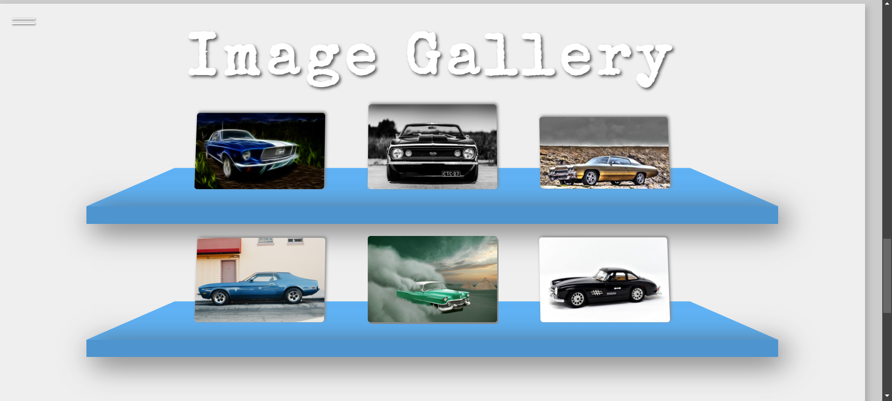
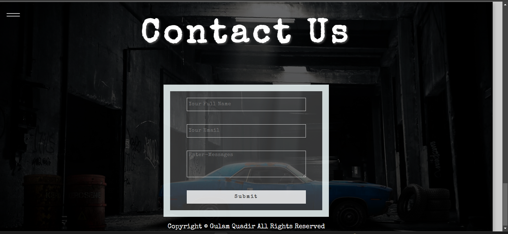
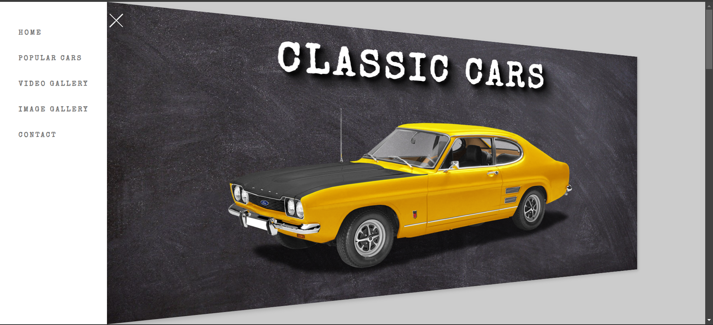

# Classic Cars Landing Page 🚗

Welcome to the *Classic Cars* landing page project! This project showcases a visually appealing and interactive web page dedicated to classic cars, built using **HTML**, **CSS**, and **JavaScript**.

# Live Link
(https://classic-cars-task.netlify.app/)
## 🌟 Features

### 1. Header Section
- **Classic Cars**: A bold heading with a beautiful car image to capture the essence of the page.

### 2. Popular Cars
- **Hover Effects**: Explore three popular classic cars, each with a subtle hover effect that adds a dynamic feel to the section.

### 3. Video Gallery
- **Interactive Videos**: Two rows of videos that play automatically when you hover over them, offering an engaging user experience.

### 4. Image Gallery
- **3D Shelves**: A creative gallery displaying six images across two shelves. Hover over the images to see a stunning 3D effect.
- **3D Elements**: Learned and implemented how to create 3D elements using CSS.

### 5. Contact Us
- **Interactive Form**: Simple input fields with a submit button for users to get in touch.
- **Footer**: A neat footer with copyright information.

### 6. Fixed Menu Navigation
- **Responsive Menu**: A fixed menu icon on the left side of the page that transforms into an X when clicked. The menu reveals the section names and rotates in a 3D environment.
- **Smooth Navigation**: Click on different navigation links to smoothly transition between sections.

## 📱 Responsiveness

- The page is fully responsive and works seamlessly across different screen sizes, providing a consistent user experience on desktop, tablet, and mobile devices.

## 🎨 Technologies Used

- **HTML5**: For structuring the content.
- **CSS3**: For styling and creating 3D effects.
- **JavaScript**: For interactivity, hover effects, and smooth navigation.

## 🚀 Getting Started

To run this project locally:

1. Clone the repository:
   ```bash
   git clone https://github.com/gulamquadir500/classic-cars.git
   ```
2. Navigate to the project directory:
   ```bash
   cd classic-cars
   ```
3. Open `index.html` in your browser to view the landing page.

## 🖼️ Screenshots

### 1. Header Section


### 2. Popular Cars Section


### 3. Video Gallery Section


### 4. Image Gallery Section


### 5. Contact Us Section


### 6. Menu Navigation



## 🤝 Contributing

Feel free to fork this repository and make contributions. Pull requests are always welcome!

---

**Enjoy exploring the world of Classic Cars!**
```

